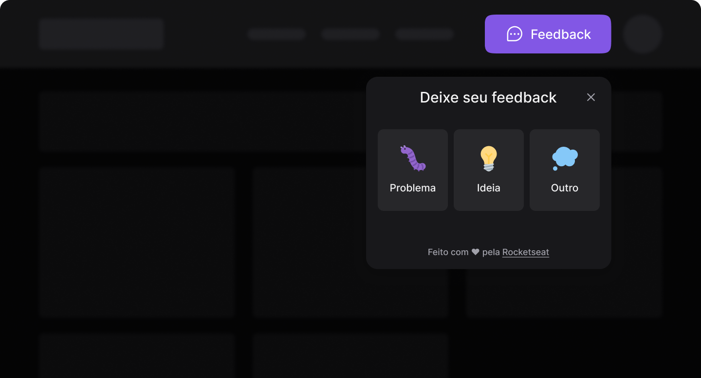

  

  <h1>Feedback Widget</h1>

  

## Sobre o projeto 🤯

Feedback Widget (ou FeedGet) é o projeto desenvolvido durante a **NLW Return**, trilha Impulse.
Ele consiste em um componente React usado em sites e aplicativos mobile para que usários possam reportar bugs, sugerir melhorias ou até mesmo dar algum feedback para a equipe de desenvolimento.

## Navegação 🧭

- [Web](https://github.com/filipeleonelbatista/feedback-widget/tree/main/web)
- [Mobile](https://github.com/filipeleonelbatista/feedback-widget/tree/main/mobile)
- [Back-end](https://github.com/filipeleonelbatista/feedback-widget/tree/main/server)

<h3 align="center" >Vamos nos conectar 😉</h3>

  &ensp;
  &ensp;
  &ensp;
  

